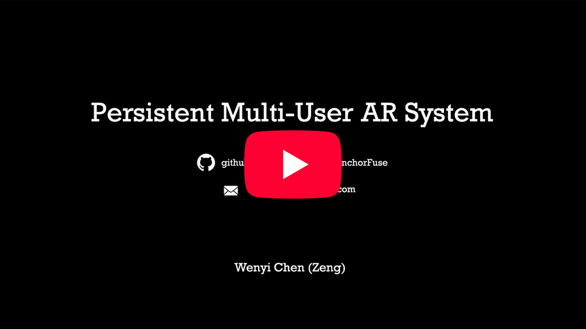

# What is AnchorFuse

**AnchorFuse** is a persistent multi-user augmented reality system designed to share and restore virtual anchors across different devices and application sessions.

It uses a hybrid localisation approach that combines **geographic positioning** and **visual localisation**. GPS provides an approximate anchor preview over a larger area, allowing nearby anchors to be discovered and placed coarsely. As the user approaches the saved location, visual features from the surrounding environment are used to refine the anchor pose and achieve more accurate restoration.

In short, AnchorFuse provides:

* **Persistent multi-user AR** across multiple devices
* **Cross-device and cross-session anchor restoration**
* **GPS-based coarse anchor placement**
* **Visual localisation for accurate pose refinement**
 

# System Overview & Demonstration

A short system overview and demonstration (under 5 minutes), including indoor/outdoor tests, is available here: 

 

