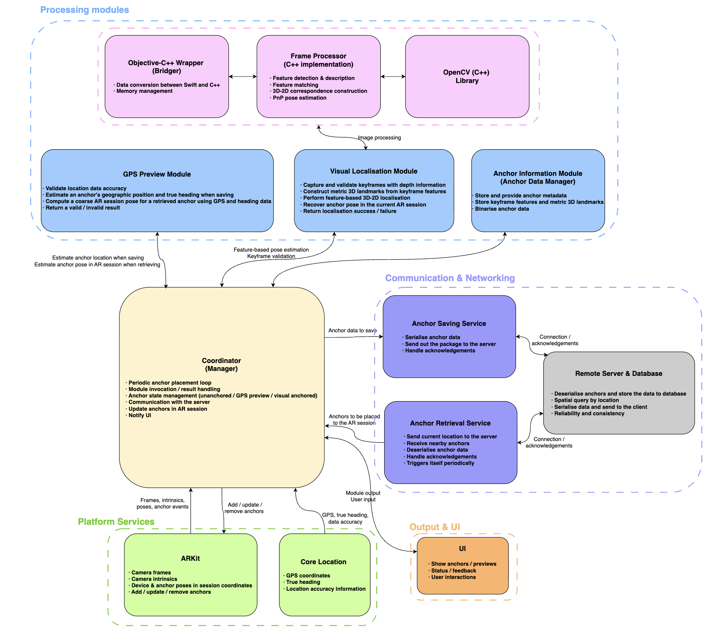

# What is AnchorFuse

**AnchorFuse** is a persistent multi-user augmented reality system designed to share and restore virtual anchors across different devices and application sessions.

It uses a hybrid localisation approach that combines **geographic positioning** and **visual localisation**. GPS provides an approximate anchor preview over a larger area, allowing nearby anchors to be discovered and placed coarsely. As the user approaches the saved location, visual features from the surrounding environment are used to refine the anchor pose and achieve more accurate restoration.

In short, AnchorFuse provides:

* **Persistent multi-user AR** across multiple devices
* **Cross-device and cross-session anchor restoration**
* **GPS-based coarse anchor placement**
* **Visual localisation for accurate pose refinement**

<br>

# System Overview & Demonstration

A short system overview and demonstration (under 5 minutes), including indoor/outdoor tests, is available here: 

<a href="https://youtu.be/hF8DkuSWqhc">
  
</a>

<br>
<br>


# System Architecture

AnchorFuse consists of three main components:

- **iOS Client**: implemented in Swift using ARKit and RealityKit. It manages AR interaction, anchor placement and restoration, geographic positioning, anchor state, and communication with the server.
- **On-Device Visual Localisation Module**: implemented in C++ with OpenCV and integrated into the Swift application through an Objective-C++ wrapper. It processes reference keyframes and LiDAR-derived metric 3D landmarks to estimate and refine anchor poses using feature matching and PnP-based pose estimation.
- **Server & Database**: a C++ server handles persistent anchor storage and retrieval, while PostgreSQL/PostGIS stores anchor data and supports spatial queries for retrieving nearby anchors.

<p align="center">
  
</p>

<p align="center">
  <em>System architecture of AnchorFuse.</em>
</p>


The system uses geographic positioning for coarse anchor discovery and placement, while visual localisation estimates a more accurate pose when the previously observed environment is recognised.
<br>
<br>

# Anchor Localisation

AnchorFuse combines two complementary localisation approaches: geographic positioning for coarse placement over larger distances, and visual localisation for more accurate restoration when the previously observed environment becomes visible.
<br>
### Geographic Positioning

When an anchor is saved, its geographic position is estimated from the device location, heading, and its pose within the current AR session. When another client approaches the area, nearby anchors are retrieved from the server and their stored geographic coordinates are converted into approximate poses in the new AR session.

This provides an immediate GPS-based preview before visual localisation is available. Because consumer-device GPS can contain significant horizontal and vertical error, this placement is treated only as a coarse estimate.
<br>
### Visual Localisation

When an anchor is saved, reference keyframes of the surrounding environment are captured. ORB features are extracted and associated with metric 3D landmarks obtained from LiDAR depth data.

During restoration, features from the current camera frame are matched against the stored reference data. The resulting 2D–3D correspondences are used with RANSAC based PnP pose estimation to recover the transformation between the reference keyframe and the current AR session.

Once a valid pose is recovered, the GPS based preview is replaced by the more accurately localised anchor.

<br>

# Repository Structure

```text
├── Client/     # iOS client, including GPS-based placement and visual localisation
├── Server/     # C++ server for anchor storage, retrieval and client communication
└── assets/     # README and demonstration media
```
<br>

# Technologies

**Swift · ARKit · RealityKit · C++ · OpenCV · Objective-C++ · PostgreSQL · PostGIS · Boost.Asio**

<br>

# License

This project is licensed under the GNU Affero General Public License v3.0 (AGPL-3.0).


